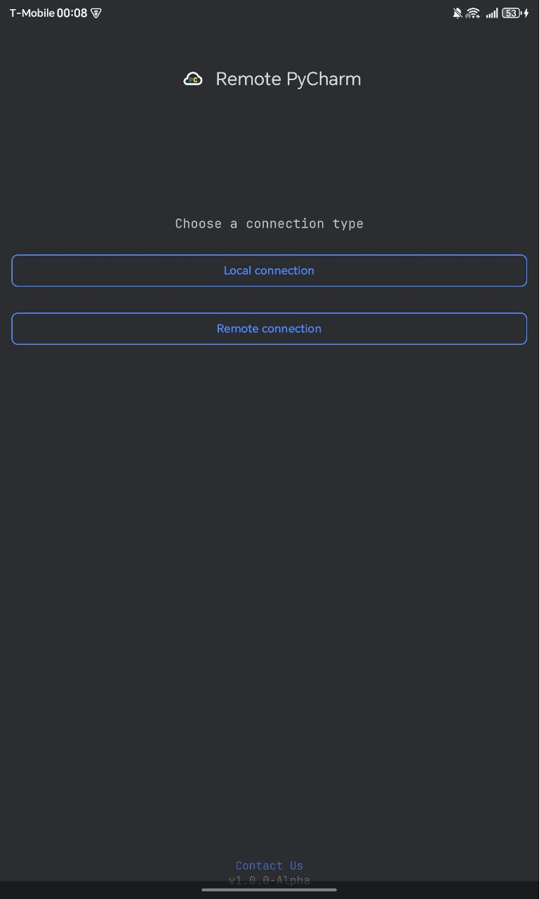
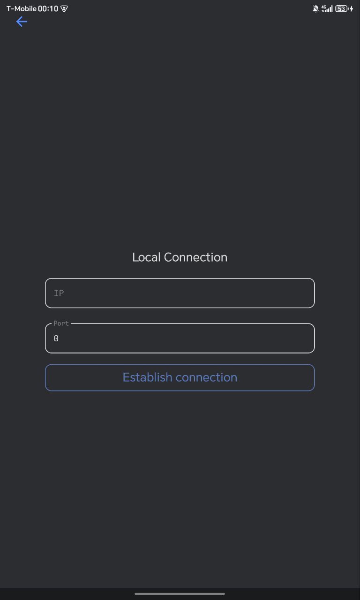
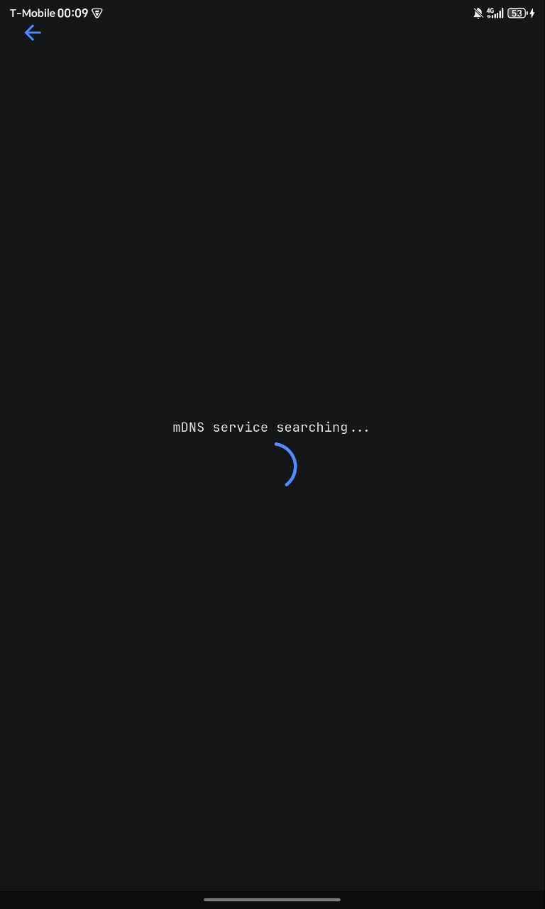
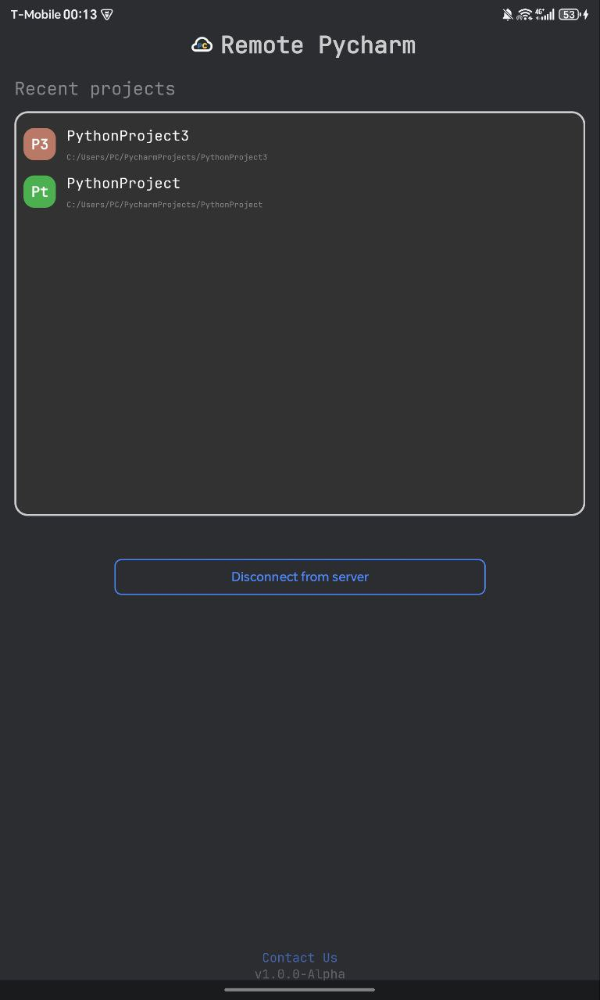
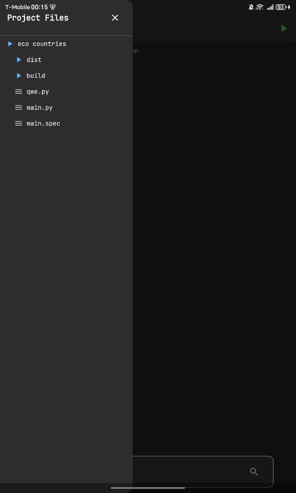
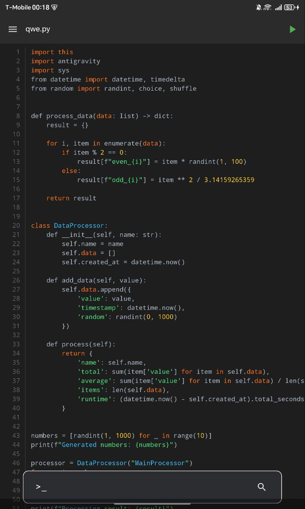
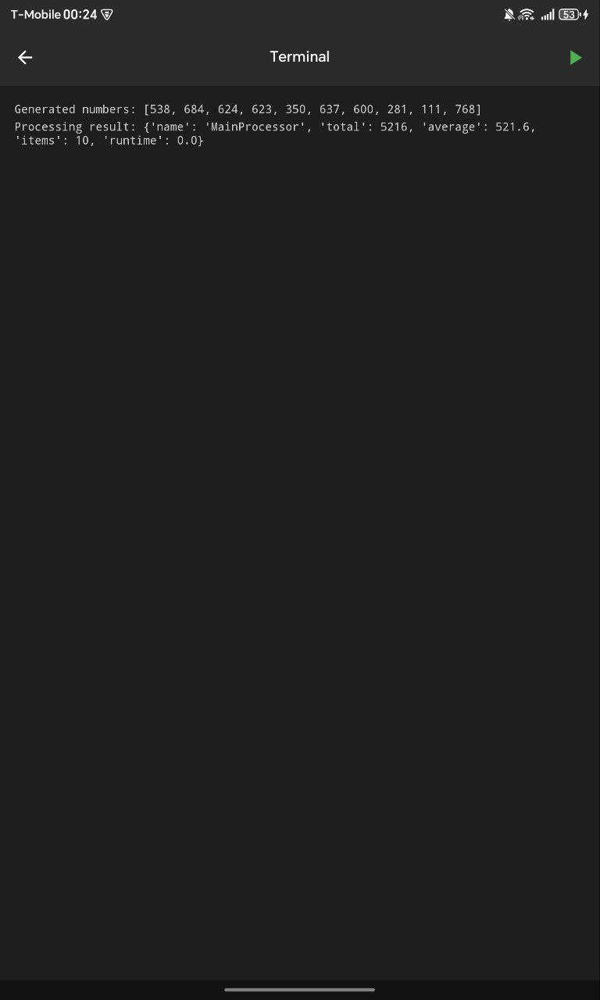
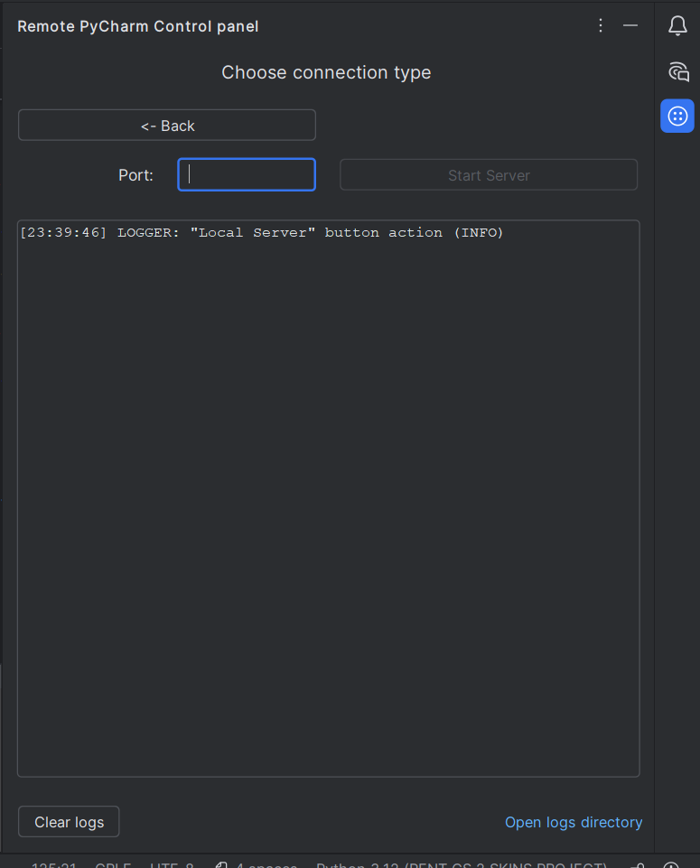
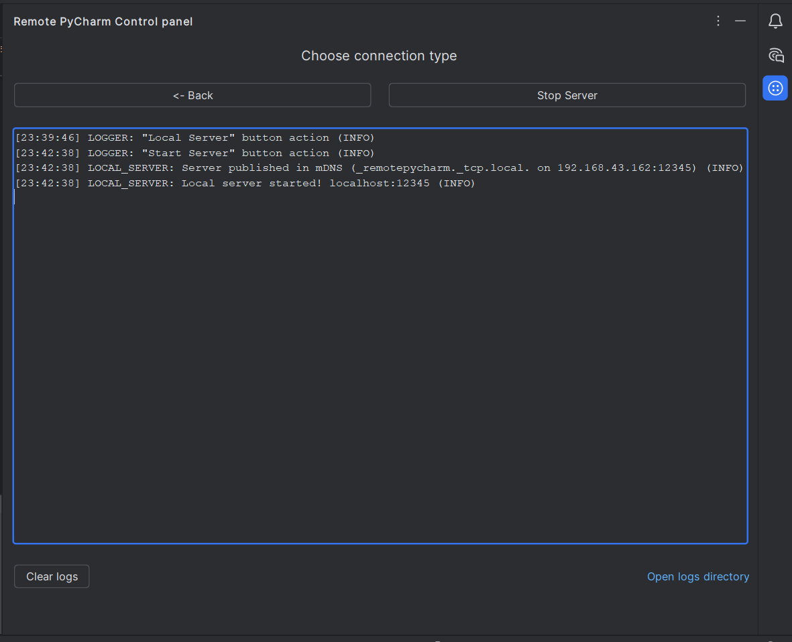
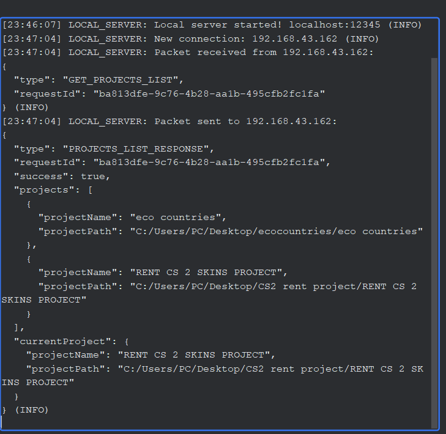

#  Remote PyCharm

**Remote PyCharm** is a mobile app + IDE plugin that lets you work with your PyCharm projects remotely — browse files, run code, and view output directly from your Android device.

- Communication is handled via WebSocket server for real-time sync between mobile and desktop.

---

## 🛠 Built with


## 📸 Screenshots

<div align="center">
  
### Mobile App
| | | |
|---|---|---|
|  |  |  |
|  |  |  |
|  | | |

### Plugin
| | |
|---|---|
|  |  |
|  |  |

</div>

## ✨ Features

### PyCharm Plugin
- **Local Ktor CIO server** — start/stop on custom port
- **Control panel UI** — server logs, packet monitoring, plugin status

### Mobile App
- **Network discovery** — auto-connect via mDNS fallback to cache and manual IP/port input
- **Project browser** — fetch and display projects from IDE
- **File tree** — open project, navigate directories, select files
- **Code viewer** — read-only editor with base syntax highlighting
- **Execution control** — run/stop project using current in IDE run configuration
- **Terminal** — output from terminated code

## 📥 Installation

### Android App
1. Download the latest APK from [Releases](https://github.com/k-racubo/RemotePyCharm/releases/)
2. Open on your device and tap "Install"
3. Allow installation from unknown sources if prompted
4. Launch Remote PyCharm

### PyCharm Plugin
1. Open PyCharm → Settings/Preferences → Plugins
2. Click → Install Plugin from Disk...
3. Select downloaded `remote-pycharm-plugin.zip`
4. Restart IDE


### Requirements:
- Android 8.0+ (API 25+)
- PyCharm 2023.1+

## 🚀 Quick Start

1. **Start plugin** — Open plugin panel and click "Start Server"
2. **Connect mobile** — Open app → Local connection → Auto-discover or enter IP:port
3. **Select project** — Choose project from list → browse files
4. **Run code** — Open a file → tap Run button → view output in terminal

## 🛠 Build from source

### Prerequisites
- JDK 21 (java 21)
- Android SDK 36
- IntelliJ IDEA / PyCharm

### Clone
```bash
git clone https://github.com/k-racubo/RemotePyCharm.git
```

### Commands
> You need locate in "kotlin" dir for execute this commands
```bash
# Android Application
./gradlew androidApp:assembleRelease
# APK: androidApp/build/outputs/apk/release/

# PyCharm Plugin
./gradlew idePlugin:buildPlugin
# Plugin: idePlugin/build/distributions/remote-pycharm-plugin.zip
# or run in IDE
./gradlew idePlugin:runIde
```

## Team
- [Nikita](https://github.com/k-racubo) 🇷🇺
- [Kirill](https://github.com/Friendly2009) 🇷🇺
- [Rinat](https://github.com/DASXER) 🇰🇿
- [Arseniy](https://github.com/Basti-cmd) 🇰🇿

Found a bug? [Open an issue](https://github.com/k-racubo/RemotePyCharm/issues/new)

## 📄 License
MIT License — see [LICENSE](LICENSE) file for details.
